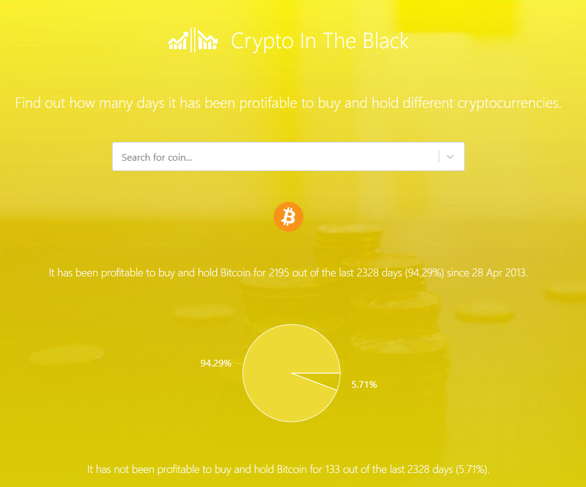

## CryptoInTheBlack.com - AWS Serverless Application Project

Simple SPA app created to play around with some of the following technologies: React, AWS serverless (Lambda, S3, API Gateway, CloudFront, CloudFormation/SAM templates).

URL: https://www.cryptointheblack.com

The environment is completely serverless and a new environment can be spun up in AWS with the following powershell script (which simply wraps some aws cli calls):
```
./deploy-env.ps1
```

The SAM/CloudFormation template creates a new environment in AWS and does the following:

- Deploys Lamda functions
- Configures API Gateway for these Lambda functions
- DNS entry for api.cryptointheblack.com -> API Gateway
- Creates S3 Bucket to host SPA website
- Configures CloudFront distribution to serve the SPA static website
- DNS entry for www.cryptointheblack.com -> CloudFront distribution

In order to deploy/update the code in the static SPA website hosted in S3 I just need to run the following:
```
./deploy-client-code.ps1
```

Multiple environments such as test and staging can be handled by passing in an environment prefix into these scripts e.g. `./deploy-env.ps1 "staging-"` This will create a completely separate environment in AWS with a site that can be accessed at https://staging-www.cryptointheblack.com (utilizing https://staging-api.cryptointheblack.com)



* * *

The project is made up of the following sub-projects:

#### /client/

React app created using create-react-app (https://github.com/facebook/create-react-app).

###### build & deploy 

```
# start the development server
npm run start

# build the production build:
npm run build

# deploy AWS cloudformation stack (change stackname as required):
aws cloudformation deploy --template template.yml --stack-name dev-www-cryptointheblack

# copy files to S3 bucket
aws s3 cp build/ s3://www.cryptointheblack.com --recursive
```

###### delete

```
# delete all files from S3 Bucket
aws s3 rm s3://dev-www.cryptointheblack.com --recursive

# delete stack (change stackname as required)
aws cloudformation delete-stack --stack-name dev-www-cryptointheblack
```

* * *

#### /server/CryptoInTheBlack/

.NET Core project for the API using AWS Lambda functions.

###### build & deploy

```
# build the project (using SAM)
# note: artifacts are saved to '.aws-sam\build'
sam build

# change directory to the build directory
cd .aws-sam\build

# package SAM template
sam package --template-file template.yaml --s3-bucket cryptointheblack --output-template-file packaged.yml

# deploy packaged SAM template (change stackname as required):
sam deploy --template-file packaged.yml --stack-name staging-cryptointheblack --capabilities CAPABILITY_IAM --parameter-overrides EnvironmentPrefix=staging
```

###### delete

```
# delete stack (change stackname as required)
aws cloudformation delete-stack --stack-name dev-api-cryptointheblack
```

* * *

#### /server/CryptoInTheBlack.IntegrationTests/

Integration tests for the /CryptoInTheBlack/ .NET Core project.

```
#run tests
dotnet test
```

* * *


#### /server/CryptoInTheBlack.Tests/

Unit tests for the /CryptoInTheBlack/ .NET Core project.

```
#run tests
dotnet test
```

* * *


#### /server/CryptoInTheBlack.Cli/

Console app created to run some periodic offline processes, currently used to generate the sitemap.xml file and also dynamically creates the CoinData file which stores basic information for each coin so users can search without having to hit the CoinGecko api for every call.

```
# generate sitemap (change output location as required)
dotnet run sitemap -o C:\location\of\sitemap.xml

# generate CoinData file (change output location as required)
dotnet run coindata -o C:\location\of\CoinData.cs
```